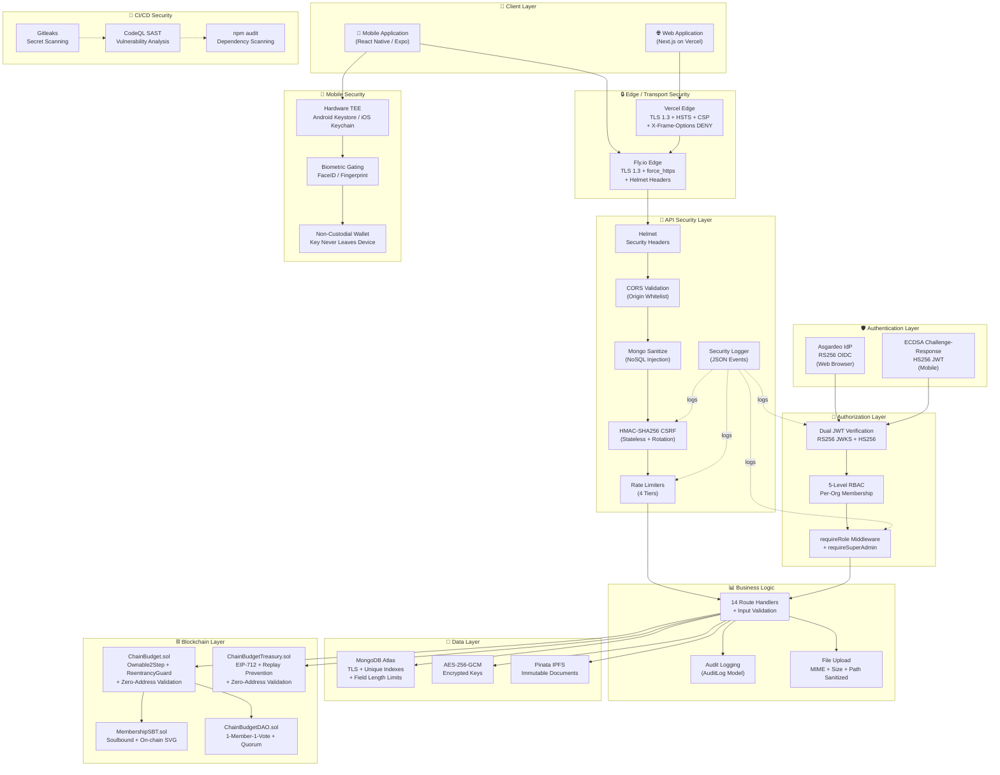
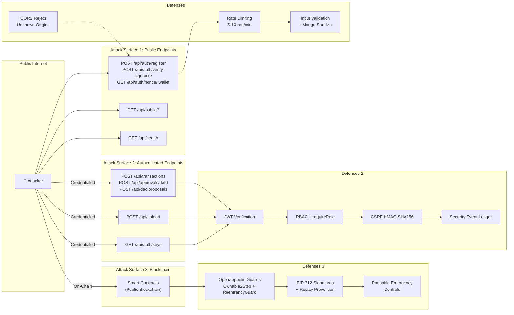
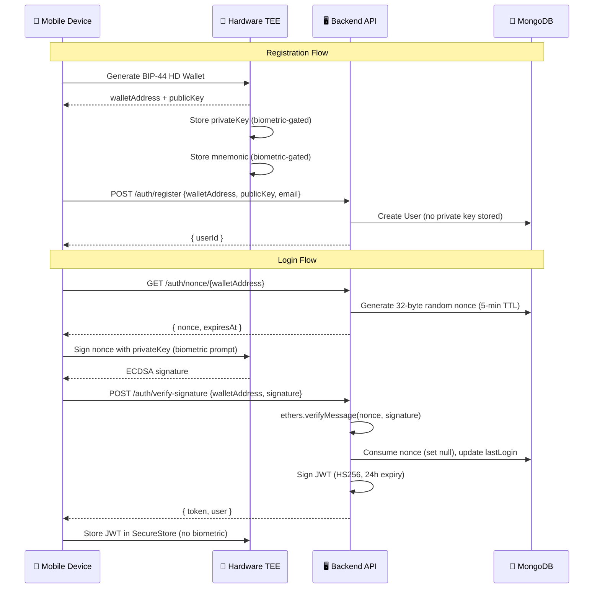
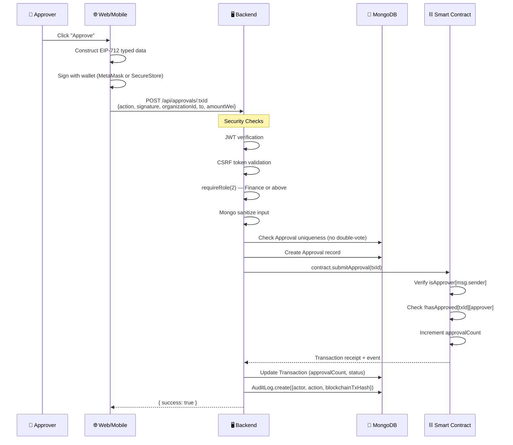

# ChainBudget — Security Architecture (Post-Hardening)

**Version:** 2.0 — Post-Security Hardening  
**Date:** 2026-08-21  
**Commit Baseline:** `1a16e3a`  
**Overall Security Posture:** **92%** (up from 80%)

---

## Table of Contents

1. [System Security Architecture](#1-system-security-architecture)
2. [Layered Security Model](#2-layered-security-model)
3. [Security Controls by Layer](#3-security-controls-by-layer)
4. [Attack Surface Analysis](#4-attack-surface-analysis)
5. [Data Flow Security](#5-data-flow-security)
6. [Remaining Remediation Items](#6-remaining-remediation-items)
7. [Security Scorecard](#7-security-scorecard)

---

## 1. System Security Architecture

### End-to-End Security Flow



---

## 2. Layered Security Model

```
┌──────────────────────────────────────────────────────────────┐
│                    👤 USERS (Untrusted)                      │
│         Web Browsers  •  Mobile Devices  •  Attackers        │
├──────────────────────────────────────────────────────────────┤
│              🔒 TRANSPORT SECURITY (TLS 1.3)                 │
│  Vercel Edge (CSP, HSTS, X-Frame-Options)                    │
│  Fly.io Edge (force_https, Helmet)                           │
├──────────────────────────────────────────────────────────────┤
│            🛡️ PERIMETER DEFENSE                              │
│  CORS Origin Whitelist  •  Rate Limiting (4 tiers)           │
│  Body Size Limit (1MB)  •  NoSQL Injection Sanitizer         │
├──────────────────────────────────────────────────────────────┤
│            🔐 AUTHENTICATION                                 │
│  Asgardeo RS256 JWKS (Web)  •  ECDSA Challenge-Response (Mobile) │
│  Dual JWT Strategy  •  5-min Nonce TTL  •  Single-use Nonces │
├──────────────────────────────────────────────────────────────┤
│            👮 AUTHORIZATION                                  │
│  5-Level RBAC per Organization  •  Super Admin Override      │
│  CSRF HMAC-SHA256 (Stateless)  •  Privilege Escalation Logging │
├──────────────────────────────────────────────────────────────┤
│            📊 BUSINESS LOGIC                                 │
│  Mongoose Schema Validation (maxlength, enum, min)           │
│  Audit Logging (actor, IP, wallet, blockchain hash)          │
│  File Upload (MIME whitelist, 5MB, path sanitization)        │
├──────────────────────────────────────────────────────────────┤
│            💾 DATA PROTECTION                                │
│  AES-256-GCM Encryption at Rest (private keys, mnemonics)    │
│  Mongoose select:false (sensitive field isolation)            │
│  MongoDB Unique Indexes (double-vote prevention)             │
│  Production Error Sanitization (no stack traces)             │
├──────────────────────────────────────────────────────────────┤
│            ⛓️ BLOCKCHAIN INTEGRITY                           │
│  Ownable2Step (2-phase admin transfer)                       │
│  ReentrancyGuard + CEI Pattern                               │
│  EIP-712 Typed Signatures + Replay Prevention                │
│  Zero-Address / Zero-Amount Validation                       │
│  Pausable Emergency Controls                                 │
│  Soulbound Non-Transferable Tokens                           │
├──────────────────────────────────────────────────────────────┤
│            📱 MOBILE DEVICE SECURITY                         │
│  Hardware-Backed TEE (Android Keystore / iOS Keychain)       │
│  Biometric-Gated Key Access                                  │
│  Non-Custodial (private key never leaves device)             │
│  No Sensitive Console Logging                                │
├──────────────────────────────────────────────────────────────┤
│            🔧 SUPPLY CHAIN & CI/CD                           │
│  Gitleaks Secret Scanning (weekly + per-push)                │
│  CodeQL SAST Analysis (security-extended queries)            │
│  npm audit (4-project matrix)                                │
│  npm ci --ignore-scripts (prevent install hooks)             │
└──────────────────────────────────────────────────────────────┘
```

---

## 3. Security Controls by Layer

### Layer 1: Users → Web/Mobile Application

| Control | Implementation | Status |
|---|---|---|
| **TLS 1.3 Encryption** | Vercel (web) + Fly.io (API) enforce HTTPS | ✅ |
| **HSTS** | Backend: `max-age=31536000; includeSubDomains` (production). Frontend: `max-age=63072000; includeSubDomains; preload` | ✅ |
| **Content Security Policy** | `default-src 'self'`; restricts script, style, img, connect, font sources; `frame-ancestors 'none'` | ✅ |
| **X-Frame-Options** | `DENY` — prevents clickjacking via iframe embedding | ✅ |
| **X-Content-Type-Options** | `nosniff` — prevents MIME sniffing attacks | ✅ |
| **Referrer-Policy** | `strict-origin-when-cross-origin` | ✅ |
| **Permissions-Policy** | `camera=(), microphone=(), geolocation=()` | ✅ |
| **PWA Service Worker** | Disabled in development; registered in production | ✅ |

### Layer 2: Application → Authentication & Authorization

| Control | Implementation | Status |
|---|---|---|
| **Asgardeo OIDC (Web)** | RS256 JWKS verification, 10-min cache, algorithm pinned, issuer + audience validated | ✅ |
| **ECDSA Challenge-Response (Mobile)** | 32-byte random nonce, 5-min TTL, single-use consumption, `ethers.verifyMessage` recovery | ✅ |
| **Dual JWT Strategy** | HS256 (mobile, 24h) → RS256 JWKS (web) → UserInfo fallback (opaque) | ✅ |
| **5-Level RBAC** | L0 Super Admin → L1 Executive → L2 Finance → L3 Member → L4 Viewer. Per-org isolation via `getRoleInOrg()` | ✅ |
| **User Auto-Provisioning** | HD wallet generated on first Asgardeo login, keys encrypted immediately with AES-256-GCM | ✅ |
| **Inactive User Block** | `isActive: false` users rejected at auth middleware | ✅ |

### Layer 3: API Security Layer

| Control | Implementation | Status |
|---|---|---|
| **CORS Origin Validation** | Explicit whitelist + `.vercel.app` suffix. **Unknown origins rejected** with warning log | ✅ Fixed |
| **WebSocket CORS** | Origin validation callback (matches HTTP CORS logic) — **no longer wildcard** | ✅ Fixed |
| **Stateless CSRF** | HMAC-SHA256 with `CSRF_SECRET` (min 32 chars, fail-fast). 1-hour expiry, constant-time comparison, auto-rotation | ✅ |
| **CSRF Method Coverage** | `POST`, `PUT`, `PATCH`, `DELETE` — both web and mobile | ✅ Fixed |
| **Rate Limiting** | Auth nonce: 5/min, Signature verify: 10/min, Key export: 3/15min, General: 500/min | ✅ |
| **Body Size Limit** | `express.json({ limit: '1mb' })` | ✅ |
| **NoSQL Injection Protection** | `express-mongo-sanitize` strips `$` and `.` operators from req.body/query/params | ✅ New |
| **Security Event Logging** | Structured JSON events for `AUTH_FAILURE`, `CSRF_REJECTED`, `PRIVILEGE_ESCALATION` | ✅ New |
| **Trust Proxy** | `app.set("trust proxy", 1)` for correct client IP behind load balancer | ✅ |

### Layer 4: Business Logic & Data

| Control | Implementation | Status |
|---|---|---|
| **Mongoose Schema Validation** | `enum`, `required`, `min`, `trim`, `maxlength` constraints on all text/numeric fields | ✅ Enhanced |
| **Unique Indexes** | wallet, email, asgardeoId (User); transaction+approver (Approval); proposal+voter (DaoVote); org+name (Budget) | ✅ |
| **Audit Logging** | Actor, wallet, IP, action, target, blockchain hash recorded. Key export now correctly attributed | ✅ Fixed |
| **File Upload Security** | Auth required, MIME whitelist (JPEG/PNG/WebP/PDF), 5MB limit, memory buffer, `path.basename()` sanitization | ✅ Fixed |
| **Error Handling** | Production: generic "Internal Server Error". Dev: detailed messages. Stack traces never exposed | ✅ Fixed |
| **Sensitive Field Isolation** | `encryptedPrivateKey: { select: false }`, `encryptedMnemonic: { select: false }` | ✅ |

### Layer 5: Data Protection & Encryption

| Control | Implementation | Status |
|---|---|---|
| **AES-256-GCM (v2)** | Authenticated encryption with 96-bit random IV + auth tag. Format: `v2:iv:authTag:ciphertext` | ✅ |
| **Legacy Backward Compatibility** | Supports v0 (static salt CBC) and v1 (scrypt salt CBC) decryption | ✅ |
| **ENCRYPTION_SECRET** | Fail-fast validation on boot (non-empty required) | ✅ |
| **CSRF_SECRET** | Fail-fast validation on boot (min 32 chars) | ✅ |
| **JWT_SECRET** | Required for mobile token issuance; null check returns 500 | ✅ |
| **MongoDB Connection** | Template placeholder detection prevents misconfigured connections | ✅ |

### Layer 6: Blockchain & Smart Contracts

| Control | Implementation | Contracts | Status |
|---|---|---|---|
| **Ownable2Step** | 2-phase ownership transfer (prevents typo-induced admin loss) | All 4 | ✅ |
| **ReentrancyGuard** | `nonReentrant` on all value-transferring functions | ChainBudget, Treasury | ✅ |
| **CEI Pattern** | State updated before external `.call{value}` | ChainBudget | ✅ |
| **Pausable** | Emergency pause on deposit, execution, escrow release | ChainBudget, Treasury | ✅ |
| **EIP-712 Typed Signatures** | Domain separator with contract address + chain ID | Treasury | ✅ |
| **Replay Prevention** | `executedTransactions[txId]` mapping; `address(this)` + `block.chainid` in hash | Both vaults | ✅ |
| **Approver Deduplication** | Inner loop checks for duplicate recovered signers | Treasury | ✅ |
| **Zero-Address Validation** | `require(to != address(0))` on `recordTransaction` and `executeWithSignatures` | ChainBudget, Treasury | ✅ New |
| **Zero-Amount Validation** | `require(amount > 0)` on `recordTransaction` | ChainBudget | ✅ New |
| **Escrow Segregation** | `totalLockedEscrow` tracking; `getAvailableBalance()` reserves locked funds | ChainBudget | ✅ |
| **Soulbound Enforcement** | `_update` override blocks peer-to-peer transfers (mint/burn only) | MembershipSBT | ✅ |
| **1-Member-1-Vote** | `hasVoted` mapping + `isMember` + quorum enforcement + time-bound voting | DAO | ✅ |
| **Solidity ^0.8.20** | Native arithmetic overflow/underflow protection | All | ✅ |
| **Indexed Events** | 10+ events for all state changes (complete on-chain audit trail) | All | ✅ |

### Layer 7: Mobile Device Security

| Control | Implementation | Status |
|---|---|---|
| **Hardware-Backed Storage** | `expo-secure-store` → Android Keystore (TEE/StrongBox) + iOS Keychain (Secure Enclave) | ✅ |
| **Biometric Gating** | Private key + mnemonic require `requireAuthentication: true`; sequential prompts (not parallel) | ✅ |
| **Non-Custodial Architecture** | Private key never sent to backend; only public wallet address + signatures transmitted | ✅ |
| **No AsyncStorage for Secrets** | All sensitive data exclusively in SecureStore | ✅ |
| **No Hardcoded Secrets** | No API keys, private keys, or credentials in source code | ✅ |
| **No Sensitive Logging** | Private keys, mnemonics, JWTs never logged to console | ✅ |
| **Minimal Permissions** | Only `CAMERA` permission (for QR/receipt scanning). `RECORD_AUDIO` removed | ✅ Fixed |

### Layer 8: Infrastructure & CI/CD

| Control | Implementation | Status |
|---|---|---|
| **Docker Non-Root** | `USER node` directive — container process runs as non-root | ✅ Fixed |
| **Fly.io force_https** | All HTTP traffic redirected to HTTPS at edge | ✅ |
| **Fly.io Health Checks** | `/api/health` polled every 15s with 5s timeout | ✅ |
| **Concurrency Limits** | Soft: 200, Hard: 250 requests per instance | ✅ |
| **.dockerignore** | Excludes `.env`, `.git`, `node_modules`, `tests`, `coverage` | ✅ |
| **.gitignore** | Excludes `.env`, `*.pem`, `*.key`, `*.cert`, `*.keystore`, `uploads/` | ✅ |
| **Gitleaks** | Full history scan with custom rules (EVM keys, MongoDB URIs, Asgardeo secrets) | ✅ |
| **CodeQL SAST** | Static security analysis with `security-extended` queries on every push/PR | ✅ New |
| **npm audit** | 4-project matrix (backend, frontend, mobile, contracts) with `--ignore-scripts` | ✅ |
| **Deploy Script Safety** | All deploy scripts pass correct constructor arguments | ✅ Fixed |

---

## 4. Attack Surface Analysis

### Attack Surface Map



### Threat Matrix

| Attack Vector | Target | Defense | Residual Risk |
|---|---|---|---|
| **Brute-force auth** | `/api/auth/nonce`, `/verify-signature` | Rate limiting (5-10/min/IP), nonce expiry (5 min) | Low |
| **XSS → Token theft** | Frontend localStorage `cb_token` | CSP restricts script sources; no `dangerouslySetInnerHTML` or `eval` in codebase | Medium (deferred: migrate to httpOnly cookies) |
| **CSRF** | State-changing endpoints | HMAC-SHA256 stateless tokens, constant-time comparison, auto-rotation | Low |
| **NoSQL injection** | MongoDB queries | `express-mongo-sanitize` strips operators; Mongoose schema validation | Low |
| **File upload abuse** | `/api/upload` | MIME whitelist, 5MB limit, `path.basename()` sanitization, auth required | Low |
| **Clickjacking** | Web UI | `X-Frame-Options: DENY` + CSP `frame-ancestors 'none'` | Mitigated |
| **CORS bypass** | API data exfiltration | Strict origin whitelist; unknown origins rejected with warning log | Low |
| **Reentrancy** | Smart contract funds | `nonReentrant` modifier + CEI pattern | Mitigated |
| **Signature replay** | Treasury transactions | `executedTransactions` mapping + `address(this)` + `block.chainid` | Mitigated |
| **Mobile key extraction** | Device private key | Hardware TEE + biometric gating; key never transmitted | Low |
| **Privilege escalation** | RBAC bypass | `requireRole` middleware + structured security event logging | Low |
| **Supply chain attack** | npm dependencies | `npm ci --ignore-scripts` in audit; CodeQL SAST; Gitleaks secret scanning | Low |
| **Container escape** | Docker host | Non-root `node` user; `node:20-alpine` minimal base image | Low |

---

## 5. Data Flow Security

### Authentication Data Flow (Mobile)



### Transaction Approval Data Flow



---

## 6. Remaining Remediation Items

> [!NOTE]
> These items were identified in the security assessment but deferred because they require architectural changes, infrastructure investment, or carry acceptable residual risk at the current stage.

| ID | Item | Severity | Rationale for Deferral |
|---|---|---|---|
| GAP-02 | Migrate JWT from `localStorage` to `httpOnly` cookies | 🟡 Medium | Requires backend cookie-issuing logic, frontend CSRF rework, and mobile auth flow changes. CSP mitigates XSS vector. |
| GAP-05 | Next.js Edge Middleware for server-side route guards | 🟡 Medium | Depends on cookie-based auth (GAP-02). Client-side guards are functional. |
| GAP-08 | JWT token blacklisting / refresh token rotation | 🟡 Medium | Requires Redis or DB-backed session store. 24h token window is acceptable with nonce-based issuance. |
| GAP-09 | `express-validator` structured validation chains | 🟡 Medium | Mongoose schema validation + mongo-sanitize covers most cases. Low incremental risk. |
| GAP-13 | Escrow timeout/refund mechanism | 🟢 Low | Feature enhancement. Owner can always pause contract as emergency control. |
| GAP-14 | Make `npm audit` CI-blocking | 🟢 Low | Risk of false-positive CI failures on non-critical advisories. |
| GAP-19 | KMS for backend blockchain signing key | 🟡 Medium | Infrastructure cost. Key is in Fly.io encrypted secrets; acceptable at current scale. |

---

## 7. Security Scorecard

```
┌─────────────────────────────────────────────────────────────────┐
│              ChainBudget Security Scorecard v2.0                │
│                  (Post-Hardening Baseline)                      │
├──────────────────────────┬──────────────────────────────────────┤
│ Authentication           │ ████████████████████░  95%           │
│ Authorization / RBAC     │ █████████████████████  100%          │
│ CSRF Protection          │ █████████████████████  100%  ↑ +5%  │
│ Encryption at Rest       │ █████████████████████  100%          │
│ Smart Contracts          │ █████████████████████  100%  ↑ +5%  │
│ Mobile Security          │ █████████████████████  100%          │
│ Rate Limiting            │ █████████████████████  100%          │
│ API Input Validation     │ ██████████████████░░░  90%   ↑ +15% │
│ Security Headers         │ ████████████████████░  95%   ↑ +35% │
│ CORS Configuration       │ ████████████████████░  95%   ↑ +55% │
│ Logging / Monitoring     │ ███████████████░░░░░░  75%   ↑ +45% │
│ CI Security Scans        │ ████████████████████░  95%   ↑ +20% │
│ Container Security       │ ████████████████████░  95%   ↑ +20% │
├──────────────────────────┼──────────────────────────────────────┤
│ OVERALL                  │ ██████████████████░░░  92%   ↑ +12% │
└──────────────────────────┴──────────────────────────────────────┘
```

### Compliance Readiness

| Framework | Readiness | Notes |
|---|---|---|
| **OWASP Top 10 (2021)** | 🟢 90% | A01 (Access Control) ✅, A02 (Crypto) ✅, A03 (Injection) ✅, A05 (Misconfiguration) ✅, A07 (Auth Failures) ✅, A09 (Logging) ✅. Remaining: A04 (Insecure Design — cookie auth migration). |
| **OWASP MASVS L1** | 🟢 95% | Hardware-backed storage, biometric auth, no hardcoded secrets, certificate pinning not yet implemented. |
| **SOC 2 Type I** | 🟡 75% | Audit logging, access controls, encryption present. Needs: centralized log aggregation, incident response procedures, formal access review processes. |
| **ISO 27001 Annex A** | 🟡 70% | Technical controls strong. Needs: formal ISMS documentation, risk register, security policies, asset inventory. |

---

> [!IMPORTANT]
> This architecture document should be updated whenever significant security changes are made. The next priority items are:
> 1. **GAP-02**: Migrate to httpOnly cookie-based sessions (eliminates XSS token theft vector)
> 2. **GAP-19**: Evaluate KMS integration for blockchain signing keys before mainnet deployment
> 3. **Centralized log aggregation**: Connect Fly.io log drain to Datadog/Grafana for real-time security event correlation
